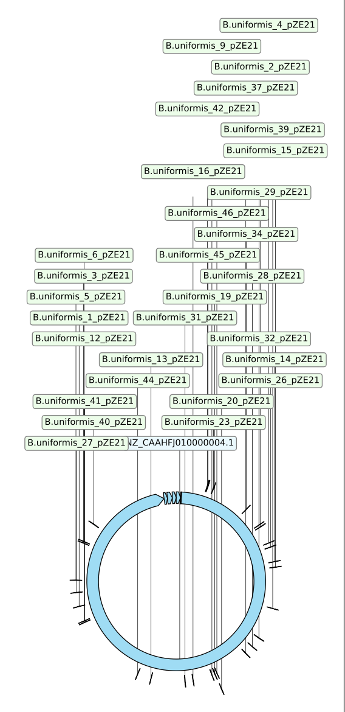
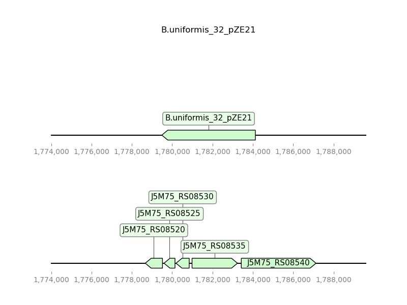

# PlottingOnGenome

## Install

BLAST is required.

## Required inputs - examples

search_term = "Bacteroides uniformis ATCC 8492 [orgn] 82G1 AND refseq AND complete genome"

email = "katarina.erbstein@embl.de"

output_prefix = "Output/buni"

seq_file = "Data/Buni_merged_seq_data_renamed.fasta"

images_prefix = "Output/images/buni_"

## Download genome from NCBI - "search_term"
For dowloading the genome of your interest from NCBI you need to provide a search_term. It is important that the search term results in a single genome being downloaded from NCBI, as you will otherwise later have issues with annotation and plotting.

Example: search_term = "Bacteroides uniformis ATCC 8492 [orgn] 82G1 AND refseq AND complete genome"

Input = str (search_term)

Output = .fasta (genome_file), .csv (locus_file)

A database will be created out of the downloaded genome for later usage druing BLASTing.

## Sequencing data - "seq_file"
You will need to provide a seq_file (.fasta format) as input to run the pipeline. It is important that the seq_file includes all your sequencing data for both forward and reverse reads.                                                                                                                                                                                

Additionally, the format of the seq_ids is important: 

Forward = "Organism_Colonynr_xx_F"   ⟹   Example = ">B.uniformis_10_pZE21_F"

Reverse = "Organism_Colonynr_xx_R"   ⟹   Example = ">B.uniformis_15_pZE21_R"   

You can enter any additional information in "xx". But, sequences MUST end with either "_F" for forward reads or "_R" for reverse reads and MUST NOT include spaces.

## BLASTing of seq_file
You need to have BLAST installed on the device you're running the pipeline on. The database created from the downloaded genome will be used for BLASTing of your sequences. 

Input = .fasta (seq_file, genome_file)

Output = .txt (blast_file)

## Annotation
Annotation of your BLASTed sequences require the locus_file which was downloaded together with the genome_file from NCBI. 

Input = .txt (blast_file), .csv (locus_file)

Output = .tsv (annot_file)

## Plotting
All contigs downloaded from NCBI will be plotted in a cicular graph. However, only the contigs that have sequences mapped to them will be labelled. 
### Plotting on circular genome
Genome contigs are plotted in a circular graph. All sequences that were successfully blasted, annotated and are not longer than 1e6 bp will be mapped onto the circular genome. Their location is indicated via a black streak and labelled with the respective seq_id (see example below). 

### Plotting single sequences on genome 
Your mapped sequences are plotted individually onto the genome, including genes that are within or in close proximity to your sequence (see below). The direction of your sequence as well as the genes on the genome are indicated with pointy tips of 

